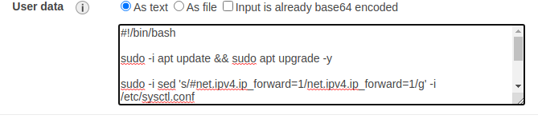

## Script para configuração do StrongSwan no Provedor AWS

### :seedling: Descrição do Projeto
Instruções para instalação e configuração do StrongSwan na AWS.

### :pencil2: Pré-requisitos
- par de chaves na AWS
- Instância EC2 ubuntu 20.04

### 🚀 Execução
1. Acesse o diretório script que está nesse repositório e copie o algoritmo.

*Você pode clicar diretamente no link abaixo:*
- [install.sh](https://github.com/aureliomalheiros/config-vpnipsec-aws/blob/dev/script/install.sh)

2. Na etapa de **Configure Instance** em **User data**, você deve colocar o script

**Vai aparecer dessa forma**

    

**Após inserir o código**

    

**Agora pode continuar a criação da instância.**

*Aguarde alguns instantes antes de conectar na instância, pois vai ocorrer a instalação e configuração do Strongswan. E por fim, a reiniciliazação da mesma.*

4. Agora você deve desabilitar o serviço de source/destination na instância.

    

**Deve ficar dessa forma e salve a configuração**

    

5. Por fim, é necessário configurar as rotas apontando diretamente para instância

**Abaixo temos um exemplo (Rede 192.168.0.0/24)**

**Em destination você deve colocar a rede privada remota**

    

**Em *Target* você deve selecionar *Instance* e depois o servidor do StrongSwan, como mostra o exemplo abaixo:**

    

    

### :speaking_head: Observações

- O ambiente apresentado é apenas a instalação e configuração da instância na AWS, não sendo feito a comunicação entre tuneis IPsec, dessa forma é necessário que você faça esses passos.
Em caso de dúvidas abaixo temos o link de exemplos:

[StrongSwan - Docs example](https://www.strongswan.org/testresults.html)

### **:books: REFERÊNCIAS**

- [StrongSwan - Public Cloud VPC](https://wiki.strongswan.org/projects/strongswan/wiki/AwsVpc)
- [AWS - Source/Destination](https://docs.aws.amazon.com/pt_br/vpc/latest/userguide/VPC_NAT_Instance.html)

