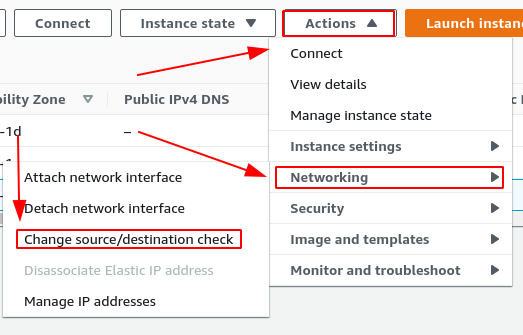
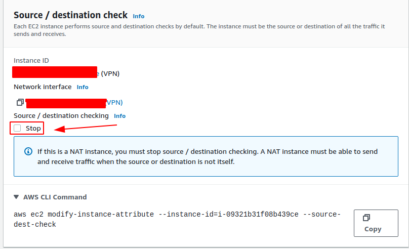
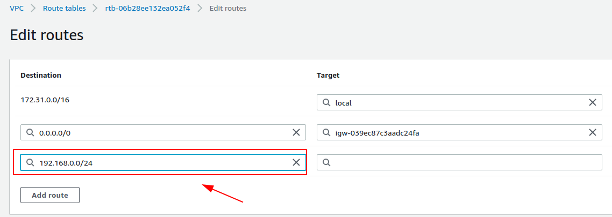
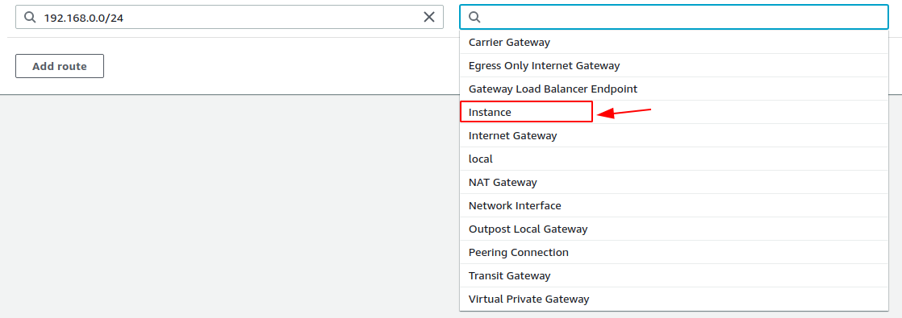
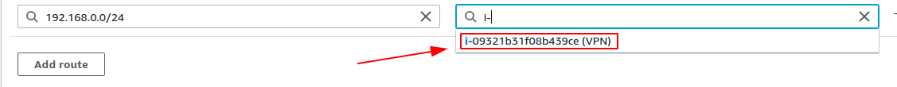

## Script para configuração do StrongSwan no Provedor AWS

### Descrição do Projeto
Instruções para instalação e configuração do StrongSwan na AWS.

### Pré-requisitos
- par de chaves na AWS
- Instância EC2 ubuntu 20.04

### 🚀 Execução
1. Acesse o diretório script e copie o algoritmo.

2. Na etapa de **Configure Instance** em **User data**, você deve colocar o script

Vai aparecer dessa forma

    

Após inserir o código

    

Agora pode continuar a criação da instância.

4. Agora você deve desabilitar o serviço de source/destination na instância.

    

Deve ficar dessa forma e salve a configuração

    

5. Por fim, é necessário configurar as rotas apontando diretamente para instância

Abaixo temos um exemplo (Rede 192.168.0.0/24)

    

    

    

### **:books: REFERÊNCIAS**

- [StrongSwan - Public Cloud VPC](https://wiki.strongswan.org/projects/strongswan/wiki/AwsVpc)
- [AWS - Source/Destination](https://docs.aws.amazon.com/pt_br/vpc/latest/userguide/VPC_NAT_Instance.html)

